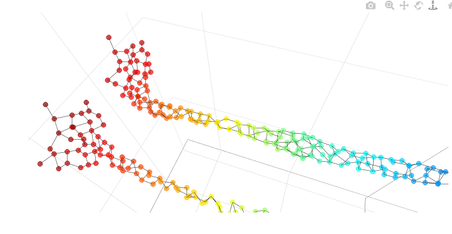
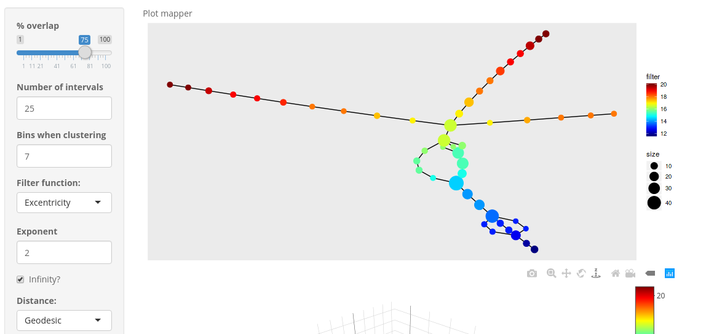
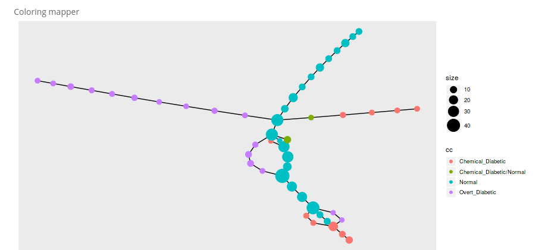

# mapperGUI

This is a Graphical User Interface for the Mapper algorithm, used in Topological Data Analysis. It is still in its initial phase. Comments and suggestions are welcome.

To read about Mapper, check the paper "Topological Methods for the Analysis of High Dimensional
Data Sets and 3D Object Recognition": https://research.math.osu.edu/tgda/mapperPBG.pdf
To read about some application, check this nice article by Matt Piekenbrock, creator of the R Mapper package that I will use in my code in the next update: https://peekxc.github.io/Mapper/articles/ShapeRecognition.html

-------------------------------------------------

## How to use it

Try it online:

https://gvituri.shinyapps.io/mapper-GUI/

This site has a limit of 25 hours of using per month, so it may not be available.

If it doesn't work, run the commands:

```R
install.packages("devtools") #run this just one time to install the package
devtools::install_github("vituri/mapperGUI") #this will install all the dependencies
shiny::runGitHub("mapperGUI", "vituri")
```

Alternatively, you can download the zip with all the files and run the "app.R" in your Rstudio. **Make sure to install all the packages on the first lines of code.**
```
library(igraph); library(TDAmapper); library(shiny); library(plotly); library(shinythemes); library(shinycssloaders)
library(GGally); library(ggplot2); library(grnn); library(ggraph); library(TDAstats) #library(rgl)
library(cccd); library(Matrix); library(dplyr)
```
--------------------------

## Insert data tab

### Custom data or examples? = Custom
Click on "browse" to select a ".csv" file of your interest. This file can contain colums with strings.

- **Header** 
Mark if the .csv has a header (a first line with column names). 

- **Separator**
The character that separates the columns in the .csv.

- **Quote** 
The character that is used to embrace quotes.

- **Decimal separator**
The character in the .csv that is used as a decimal separator.

- **Display**
How much of the .csv to display. If "Head", just the first lines. If "All", the entire .csv.

- **Normalize**
The type of normalization in your data. "none" does nothing. "uniform" do a linear scaling such that every column has values from 0 to 1. "zscore" is the Z-Score Normalization with mean 0 and standard deviation 1. 

These last two will give an error if you have non-numeric columns. Use the "Exclude columns?" to exclude these.

For data that is not "geometric" (like the diabetes dataset), it is commom to use the zscore normalization. 

Check, for example, https://www.codecademy.com/articles/normalization for details.

- [X] **Exclude columns?**
Choose columns to be excluded. The non-numeric columns must be excluded for the calculations. You will be able to use these excluded columns later to color the nodes later (even the non-numeric ones!).

- [X] **Select fewer points?** conditional widget. If your data has too many points (more than 25000), the app is going to crash (at least in my machine it does :( ). This happens because the code calculates the distance matrix of the metric space inserted, and this matrix will be of size n^2, where n is the number of points in your data. For 25000 points, this gives a matrix of near 8gb. To avoid this, when a dataset has more than 2000 points a widget will appear with "select fewer points?" checked, and the custom value is 2000. You can increase this number at your will. These fewer points are selected via a "farthest points sample", that selects "well spreaded" points. Do some testing with the flamingo and elephant datasets.

### Custom data or examples? = Examples

These are some examples to play around with the mapper.

- **Cancer** dataset

- **Diabetes** dataset

- **Elephant** dataset

- **Flaming** dataset

- **Head** dataset

- **Sphere** dataset

n random points sampled from a 2-dimensional sphere.

- **Torus** dataset

n random points sampled from a torus.

### What is being shown?

- A plot of the first three variables of your data.

- A summary of your data.

- The display of your data.

Notice that the table showing in your right is going to be your metric space for all the Mapper calculations.

## Mapper tab

- **% overlap** The % of overlap of the intervals in your codomain. More overlap will give you more edges.

- **Number of intervals** The number of intervals in the covering. More intervals will give you more vertices.

- **Bins when clustering** The amount of bins used in the clustering algorithm. More bins will give you more vertices on the same levelset: your data will be more "spread" in vertices. Less bins will yield less vertices. Do some tests with the flamingo dataset to get a feeling. Sometimes the legs of the flamingo are glued together in the Mapper and to separate them you need to increase the number of bins.

- **Graph layout** A list with several layouts for the mapper graph. See the details here: https://igraph.org/r/doc/

- **Filter function** There are some filter functions available:
  - **Singular value decomposition** Chosse the column of the singular value decomposition matrix. This filter is a "good projection" of your data into the real line.
  - **Data column** Select a data column to use as filter.
  - **Excentricity** How far your point is from the "center" of your data.
  - **Distance to measure**
  - **Density** Are there many points close to a given point in your data? High values mean many points.
  
 See http://danifold.net/mapper/filters.html for details.
 
- **Distance** The distance used in the calculations. All the filter functions (except "data column") will use this distance in the calculations. 
  - **Graph walk** Construct the Relative Neighborhood Graph of your metric space and calculate the geodesic distance of this graph (the distance between two points is the lenght of the shortest path between them). If your data has 3 dimensions, the graph will be plotted along with your data. Try this with the flamingo dataset, for example.
 
  - **Euclidean and all others** are taken from the proxy package. Read the description here: https://github.com/cran/proxy/blob/master/R/dissimilarities.R

### What is being shown?

- The mapper plot.
 

- A plot with the first three variables of your data.

## Coloring tab

- **Coloring function** Choose the function to color the mapper previously constructed. The nodes will be colored by the average value that the coloring function assumes on each vertex (remember that each vertex is a cluster of the original dataset). *You will be able to select previously excluded columns, even columns of characters*. Try the diabetes database and color the nodes by the "diabetic" or the "cc" (clinical condition) column. In the case of character column, the result will be a voting. In case of a tie, a "/" will appear in the legend with the most voted.
 
